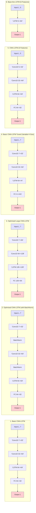

```mermaid
graph LR
    subgraph Basic_CNN_LSTM ["1. Basic CNN-LSTM"]
        Input_A[Input L, 7] --> Conv1_A['Conv1D 7->32']
        Conv1_A --> Conv2_A['Conv1D 32->64']
        Conv2_A --> LSTM_A['LSTM 64->64']
        LSTM_A --> FC1_A[FC 64->32]
        FC1_A --> Output_A[Output 1]
        style Input_A fill:#e0e0ff,stroke:#666
        style Output_A fill:#ffcdd2,stroke:#666
    end
    
    subgraph Optimised_CNN_LSTM ["2. Optimised CNN-LSTM (with BatchNorm)"]
        Input_B[Input L, 7] --> Conv1_B['Conv1D 7->32']
        Conv1_B --> BN1_B[BatchNorm]
        BN1_B --> Conv2_B['Conv1D 32->64']
        Conv2_B --> BN2_B[BatchNorm]
        BN2_B --> LSTM_B['LSTM 64->64']
        LSTM_B --> FC1_B[FC 64->32]
        FC1_B --> Output_B[Output 1]
        style Input_B fill:#e0e0ff,stroke:#666
        style Output_B fill:#ffcdd2,stroke:#666
    end
    
    subgraph Optimised_Large_CNN_LSTM ["3. Optimised Large CNN-LSTM"]
        Input_C[Input L, 7] --> Conv1_C['Conv1D 7->64']
        Conv1_C --> Conv2_C['Conv1D 64->128']
        Conv2_C --> LSTM_C['LSTM 128->128']
        LSTM_C --> FC1_C[FC 128->64]
        FC1_C --> Output_C[Output 1]
        style Input_C fill:#e0e0ff,stroke:#666
        style Output_C fill:#ffcdd2,stroke:#666
    end
    
    subgraph Basic_CNN_LSTM_Tuned ["4. Basic CNN-LSTM Tuned (Variable H Size)"]
        Input_D[Input L, 7] --> Conv1_D['Conv1D 7->32']
        Conv1_D --> Conv2_D['Conv1D 32->64']
        Conv2_D --> LSTM_D['LSTM 64->H']
        LSTM_D --> FC1_D[FC H->H/2]
        FC1_D --> Output_D[Output 1]
        style Input_D fill:#e0e0ff,stroke:#666
        style Output_D fill:#ffcdd2,stroke:#666
    end
    
    subgraph CNN_LSTM_Model_5 ["5. CNN-LSTM (5 Features)"]
        Input_E[Input L, 5] --> Conv1_E['Conv1D 5->32']
        Conv1_E --> Conv2_E['Conv1D 32->64']
        Conv2_E --> LSTM_E['LSTM 64->64']
        LSTM_E --> FC1_E[FC 64->32]
        FC1_E --> Output_E[Output 1]
        style Input_E fill:#e0e0ff,stroke:#666
        style Output_E fill:#ffcdd2,stroke:#666
    end

    subgraph Base_line_LSTMModel ["6. Base-line LSTM (5 Features)"]
        Input_F[Input L, 5] --> LSTM_F['LSTM 5->64']
        LSTM_F --> Output_F[Output 1]
        style Input_F fill:#e0e0ff,stroke:#666
        style Output_F fill:#ffcdd2,stroke:#666
    end
```
